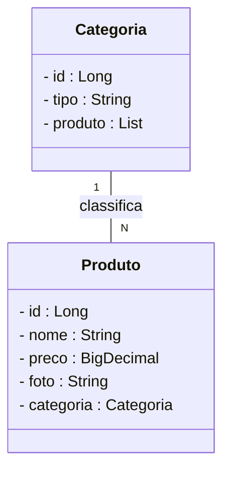
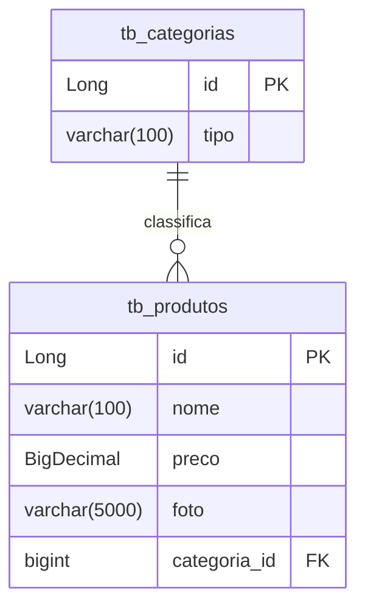

# Projeto E-Commerce Farmácia 
## Backend com Spring Boot


<div align="center">
     
</div>


<div align="center">
  
  
  
  
  
  
  

</div>


## 1. Descrição

A **E-Commerce Farmácia** é um Projeto Spring elaborado no STS (Spring Tool Suite), com o objetivo de implementar um Sistema de Comércio Eletrônico de uma Farmácia. A aplicação visa otimizar as operações diárias e melhorar a qualidade dos serviços oferecidos, endereçando os desafios únicos do setor farmacêutico.

O projeto exige a implementação dos Recursos **Produto** e **Categoria**, com um Relacionamento do tipo Um para Muitos.

Entre os principais recursos e requisitos do projeto, destacam-se:

1.  Criação do CRUD completo (6 Métodos) para o recurso **Categoria**.
2.  Criação do CRUD completo (6 Métodos) para o recurso **Produto**, relacionado com o Recurso Categoria.
3.  Implementação do Relacionamento **OneToMany Bidirecional** entre os Recursos Produto e Categoria.
4.  Desenvolvimento do projeto utilizando o **Spring Tool Suite (STS)**, seguindo as boas práticas.
5.  Versionamento do código através do **Git/GitHub** com branches específicas para cada etapa (`01_Configurando_Projeto`, `02_CRUD_Categoria`, `03_CRUD_Produto_Relacionamento`).


## 2. Sobre esta API

A API da Farmácia foi desenvolvida utilizando **Java** e o **framework Spring Boot**, seguindo os princípios da Arquitetura MVC e REST. Ela oferece endpoints para o gerenciamento dos recursos **Produto** e **Categoria**, com foco na simulação de um sistema real de e-commerce farmacêutico.

<br />

### 2.1. Principais funcionalidades da API:

1.  Consulta, criação e gerenciamento completo (CRUD) de categorias (6 métodos).
2.  Cadastro, edição, listagem e exclusão completo (CRUD) de produtos (6 métodos).
3.  Associação de produtos a categorias através do Relacionamento **OneToMany Bidirecional**.
4.  Testes de endpoints realizados via Insomnia para validação do CRUD e do relacionamento.


## 3. Diagrama de Classes

**Diagrama de Classes** representa a estrutura do sistema, mostrando as classes, atributos e o relacionamento entre as duas entidades principais exigidas no projeto: **Produto** e **Categoria**.




## 4. Diagrama Entidade-Relacionamento (DER)

O **DER** representa como os dados estão organizados no banco de dados relacional, incluindo tabelas e relacionamentos.

O **DER** (Diagrama de Entidade-Relacionamento) representa como os dados estão organizados no banco de dados relacional, incluindo as tabelas e o relacionamento Um para Muitos (1:N) entre elas[cite: 41].




## 5. Tecnologias utilizadas

| Item                          | Descrição               |
| ----------------------------- | ----------------------- |
| **Linguagem de programação**  | Java                    |
| **Framework**                 | Spring Boot             |
| **IDE**                       | Spring Tool Suite (STS) |
| **Banco de dados Relacional** | (A definir, configurado no `application.properties`)|
| **Geren. de Dependências**    | Maven/Gradle            |
| **Teste de API**              | Insomnia (ou Postman)   |
| **Versionamento**             | Git / GitHub            |


## 6. Requisitos

Para executar os códigos localmente, você precisará:

- [Java JDK 17+](https://www.oracle.com/java/technologies/javase/jdk17-archive-downloads.html)
- Banco de dados [MySQL](https://dev.mysql.com/downloads/)
- [STS](https://spring.io/tools)
- [Insomnia](https://insomnia.rest/download) ou [Postman](https://www.postman.com/)


## 7. Como Executar o projeto no STS


### 7.1. Importando o Projeto

1. Clone o repositório do Projeto [E-Commerce Farmácia](https://github.com/lefcc/projeto_final_bloco_02/tree/main) dentro da pasta do *Workspace* do STS

```bash
git clone https://github.com/lefcc/projeto_final_bloco_02.git
```

1. **Abra o STS** e selecione a pasta do *Workspace* onde você clonou o repositório do projeto
2. No menu superior do STS, clique em **File 🡲 Import...**
3. Na janela **Import**, selecione **General 🡲 Existing Projects into Workspace** e clique em **Next**
4. No item **Select root directory**, clique em **Browse...** e selecione a pasta do Workspace onde clonou o repositório
5. O STS reconhecerá o projeto automaticamente
6. Marque o Projeto -projeto_final_bloco_02 (E-Commerce Farmacia)  no item **Projects** e clique em **Finish**


### 7.2. Executando o projeto

1. Na Guia **Boot Dashboard**, localize o **Projeto E-Commerce Farmacia **
2. Selecione o **Projeto E-Commerce Farmacia**
3. Clique no botão **Start or Restart**  para iniciar a aplicação
4. Caso solicitado, autorize o acesso à rede para o projeto
5. Acompanhe a inicialização no console do STS
6. Verifique se o banco de dados `db_ecommerce_farmacia` foi criado corretamente com as tabelas necessárias
7. Utilize o [Insomnia](https://insomnia.rest/) ou o [Postman](https://www.postman.com/) para testar os endpoints


>
> Ao acessar a URL `http://localhost:8080` em seu navegador, a interface do Swagger será carregada automaticamente, permitindo a visualização e interação com os endpoints da API e consulta dos modelos de dados.


## 8. Contribuição

Este repositório é parte de um projeto da saúde, mas contribuições são bem-vindas! Caso tenha sugestões, correções ou melhorias, fique à vontade para:

- Criar uma **issue**
- Enviar um **pull request**
- Compartilhar com colegas que estejam aprendendo Java!

<br />

## 9. Contato

Desenvolvido por [**Letícia Campos**](https://github.com/lefcc).

Para dúvidas, sugestões ou colaborações, entre em contato via GitHub ou abra uma issue!